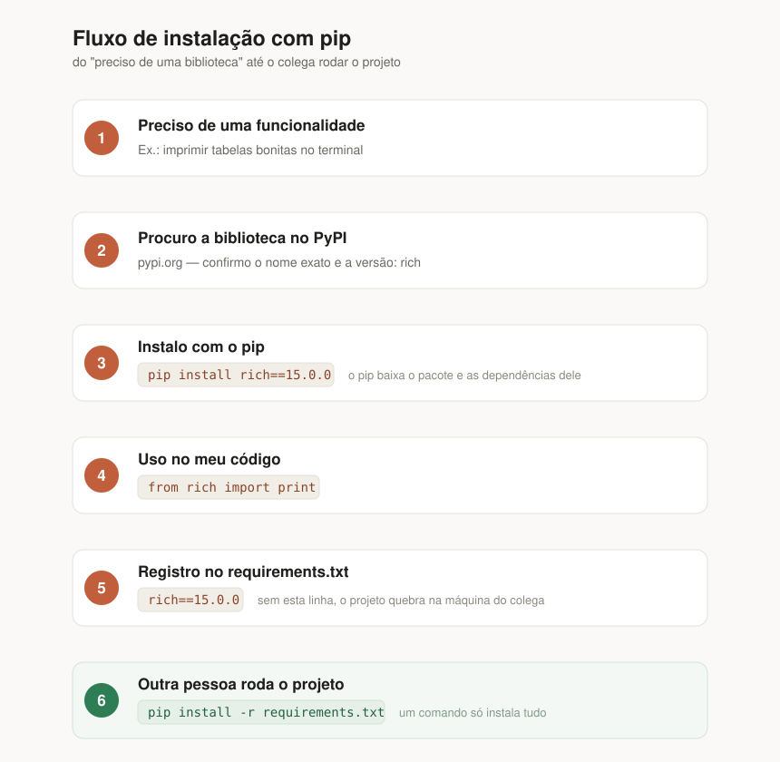

# Guia: pip e instalação de bibliotecas

## 1. O que é o pip

O `pip` é o **gerenciador de pacotes do Python**. Ele é quem baixa, instala, atualiza e remove bibliotecas que outras pessoas escreveram, para que você não precise reinventar a roda.

Ele já vem junto com o Python. Para conferir se está disponível:

```bash
pip --version
```

Se o comando `pip` não for reconhecido, use a forma mais segura (garante que é o pip do Python que você está usando):

```bash
python -m pip --version
```

> Dica: `python -m pip ...` funciona em qualquer lugar e evita a maioria dos problemas de "comando não encontrado". Pode usar sempre assim.

---

## 2. De onde vêm as bibliotecas: o PyPI

Todas as bibliotecas que o pip instala vêm do **PyPI** (Python Package Index):

🔗 https://pypi.org/

O PyPI é o "catálogo oficial" de bibliotecas Python. Lá você encontra:

- o nome exato do pacote (é esse nome que vai no `pip install`);
- as versões disponíveis;
- a documentação e o link do repositório.

Antes de instalar algo que você viu em um tutorial, vale procurar no PyPI para confirmar o nome e a versão.

---
## 3. Pacotes comuns

Você não precisa decorar nada disso — a ideia é conhecer os nomes e saber que existem. Instale só o que o seu projeto realmente precisar.

### Utilidades do dia a dia

| Instala com | Importa com | Para que serve |
|---|---|---|
| `requests` | `requests` | fazer requisições HTTP, consumir APIs |
| `rich` | `rich` | texto colorido, tabelas e barras de progresso no terminal |
| `python-dotenv` | `dotenv` | ler variáveis de um arquivo `.env` (senhas, chaves) |
| `tabulate` | `tabulate` | montar tabelas simples em texto puro |

### Banco de dados

| Instala com | Importa com | Para que serve |
|---|---|---|
| `mysql-connector-python` | `mysql.connector` | conectar no MySQL |
| `psycopg2-binary` | `psycopg2` | conectar no PostgreSQL |
| `SQLAlchemy` | `sqlalchemy` | ORM: trabalhar com as tabelas como objetos Python |
| `pymongo` | `pymongo` | conectar no MongoDB |

> O **SQLite** não precisa de instalação: o módulo `sqlite3` já vem junto com o Python.

### Dados e análise

| Instala com | Importa com | Para que serve |
|---|---|---|
| `pandas` | `pandas` | ler e tratar CSV, planilhas e resultados de SQL |
| `numpy` | `numpy` | cálculo numérico e arrays |
| `matplotlib` | `matplotlib` | gerar gráficos |
| `openpyxl` | `openpyxl` | ler e escrever arquivos `.xlsx` |

### Web e automação

| Instala com | Importa com | Para que serve |
|---|---|---|
| `flask` | `flask` | criar sites e APIs simples |
| `fastapi` | `fastapi` | criar APIs modernas e rápidas |
| `beautifulsoup4` | `bs4` | extrair dados de páginas HTML (web scraping) |
| `selenium` | `selenium` | automatizar o navegador |

### Qualidade de código

| Instala com | Importa com | Para que serve |
|---|---|---|
| `pytest` | `pytest` | escrever e rodar testes automatizados |
| `black` | — (só linha de comando) | formatar o código automaticamente |
| `flake8` | — (só linha de comando) | apontar erros de estilo e código morto |

Repare que **o nome de instalação nem sempre é o nome do import** (`beautifulsoup4` → `bs4`, `python-dotenv` → `dotenv`). Isso é normal e está sempre documentado na página do pacote no PyPI.

---


## 4. O fluxo completo, do zero ao código rodando



O ponto mais importante: **instalar não é suficiente**. Se a biblioteca não estiver anotada no `requirements.txt`, o projeto quebra na máquina do colega.

---

## 5. Comandos do dia a dia

### Instalar a versão mais recente

```bash
pip install rich
```

### Instalar uma versão específica

```bash
pip install rich==15.0.0
```

Usar `==` é o modo de **travar a versão**. Isso garante que todo mundo no projeto rode exatamente o mesmo código da biblioteca. Sem isso, um colega pode receber uma versão nova que mudou algum comportamento e o código dele quebra.

Outros operadores que você vai ver por aí:

| Forma | Significado |
|---|---|
| `rich` | qualquer versão (pega a mais nova) |
| `rich==15.0.0` | exatamente a 15.0.0 |
| `rich>=15.0.0` | da 15.0.0 para cima |
| `rich>=15.0,<16.0` | da 15.x, mas sem pular para a 16 |

Na aula, prefira sempre `==`.

### Ver o que está instalado

```bash
pip list
```

Mostra todos os pacotes instalados em formato de tabela, legível para humanos.

### Gerar a lista no formato do requirements

```bash
pip freeze
```

Mostra a mesma coisa, mas já no formato `pacote==versão`, pronto para colar no `requirements.txt`.

### Ver detalhes de um pacote

```bash
pip show rich
```

Mostra versão instalada, autor, onde o pacote foi instalado e quais dependências ele puxou.

### Atualizar um pacote

```bash
pip install --upgrade rich
```

### Desinstalar

```bash
pip uninstall rich
```

> Atenção: o `uninstall` remove **só** o pacote que você pediu, não as dependências que ele trouxe junto.

---

## 6. O requirements.txt

Esse arquivo é a **receita do projeto**: a lista de tudo que precisa estar instalado para o código funcionar.

Exemplo, o do nosso projeto:

```
rich==15.0.0
requests==2.34.2
```

Regras de leitura:

- uma dependência por linha;
- `nome==versão`;
- linhas começando com `#` são comentários e o pip ignora.

### Instalar tudo de uma vez

Quando alguém clona o projeto, roda **um comando só**:

```bash
pip install -r requirements.txt
```

O `-r` significa *read* — "leia esse arquivo e instale cada linha dele".

### Como manter o arquivo atualizado

Há duas formas:

**a) Na mão (recomendado para aprender):** instalou algo novo, abra o `requirements.txt` e adicione a linha.

```bash
pip install requests
pip show requests        # descubro a versão instalada
# adiciono "requests==2.34.2" no requirements.txt
```

**b) Automático:**

```bash
pip freeze > requirements.txt
```

Isso sobrescreve o arquivo com tudo que está instalado. É rápido, mas cuidado: ele grava **todas** as dependências indiretas também, e apaga seus comentários. 

---

## 7. Ciclo de trabalho em equipe

**Quem cria o projeto:**

```bash
pip install rich==15.0.0     # instala
# anota no requirements.txt
git add requirements.txt     # versiona o arquivo
```

**Quem recebe o projeto:**

```bash
git clone <repositorio>
cd <projeto>
pip install -r requirements.txt   # instala tudo
python main.py                    # roda
```

É por isso que o `requirements.txt` **sempre** vai para o repositório: ele é a ponte entre a sua máquina e a dos outros.

---

## 8. Erros comuns e como resolver

### `ModuleNotFoundError: No module named 'rich'`

O Python não encontrou a biblioteca. Causas prováveis:

1. você esqueceu de instalar → `pip install rich`;
2. instalou, mas com nome errado (confira no PyPI);
3. você tem mais de um Python instalado e o pip usado não é o mesmo que está rodando o script → use `python -m pip install rich`.

### `ERROR: Could not find a version that satisfies the requirement ...`

O pip não achou o pacote ou a versão. Confira:

- a **grafia** do nome (`beautifulsoup4`, não `beautifulsoup`);
- se a **versão existe** — abra a página do pacote no PyPI, aba *Release history*;
- sua conexão com a internet / proxy.

### Instalei, mas o import continua falhando

Verifique qual Python está sendo usado:

```bash
python -c "import sys; print(sys.executable)"
python -m pip show rich
```

Se os caminhos não baterem, você instalou em um Python e está executando em outro. Padronize usando sempre `python -m pip`.

### O nome do pacote é diferente do nome do import

Isso é normal e pega muita gente:

| Instala com | Importa com |
|---|---|
| `pip install beautifulsoup4` | `import bs4` |
| `pip install pillow` | `import PIL` |
| `pip install psycopg2-binary` | `import psycopg2` |
| `pip install python-dotenv` | `import dotenv` |

A página do pacote no PyPI sempre mostra o nome correto do import nos exemplos.

---

## 9. Resumo — cola rápida

| Objetivo | Comando |
|---|---|
| Ver versão do pip | `pip --version` |
| Instalar | `pip install pacote` |
| Instalar versão específica | `pip install pacote==1.2.3` |
| Instalar tudo do projeto | `pip install -r requirements.txt` |
| Listar instalados | `pip list` |
| Listar no formato requirements | `pip freeze` |
| Detalhes de um pacote | `pip show pacote` |
| Atualizar | `pip install --upgrade pacote` |
| Remover | `pip uninstall pacote` |

**As três regras de ouro:**

1. Achou a biblioteca no PyPI → instale pelo nome exato.
2. Trave a versão com `==`.
3. Tudo que você instalar, registre no `requirements.txt`.
